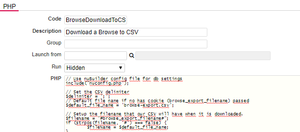

### Adding a "Download to CSV" button in a Browse Screen

This guide explains how to add a "Download to CSV" button to a browse screen, enabling users to download data as a CSV file.

1. Create a [Procedure](https://wiki.nubuilder.cloud/nubuilderforte/index.php/Procedures): Procedure -> Add

2. Code: BrowseDownloadToCSV

3. Add a description, such as "Downloads data in a Browse Screen as CSV".

4. Copy the PHP code from [BrowseDownloadToCSV.php](BrowseDownloadToCSV.php) and paste it into the PHP field of your new procedure.

<p align="left">
  
</p>

5. Click Save to store your procedure.

6. In your form’s Custom Code / Browse field, insert the following JavaScript snippet:

❓ [How to add Custom Code](/codelib/common/form_add_custom_code_javascript.gif)

```
function browseDownloadToCSV() {
    const fileDelimiter = ';';
    const fileName = 'browse_download.csv';

    nuRunPHPWithParams('BrowseDownloadToCSV', 'BrowseDownloadParams', {
        file_name: fileName, file_delimiter: fileDelimiter, sql: nuCurrentProperties().browse_sql
    });
}

nuAddActionButton('browseDownloadToCSV', 'Download to CSV', 'browseDownloadToCSV();');
```

7. Ensure all changes are saved after adding the JavaScript.

Outcome: Now, a "Download to CSV" button will appear on your Browse Screen, allowing users to export data directly in CSV format.

