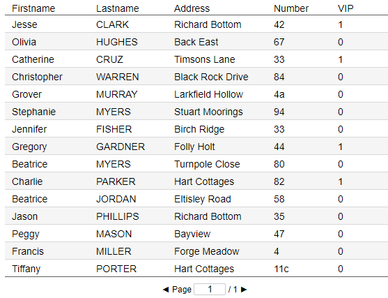
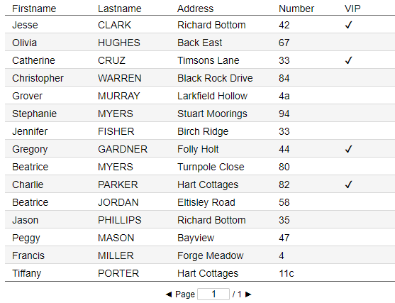
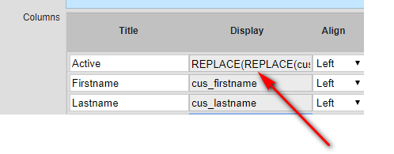

## Make Boolean Fields Show Check Marks

### nuBuilder's default

Boolean values are shown as 1 (true) and 0 (false)

<p align="left">
  
</p>

### 3 Possibilities to show a tick or a checkbox instead of display 0, 1 values:

#### 1.  Show a (check) mark character

Make boolean fields show check marks or blanks based on their value.

<p align="left">
  
</p>

☛  Modify the Display field of your Boolean field:

<p align="left">
  
</p>

```
REPLACE(REPLACE(cus_active,1,'✔'),0,'')
```

#### 2. Use nuOnProcessBrowseRows() in BB (Before Browse, PHP):

```
function nuOnProcessBrowseRows() {
    $count = count($f->browse_rows);
    for ($i = 0;$i < $count;$i++) {

        $tick = '';
        if ($f->browse_rows[$i][0] == '1') { // 0 = 1st column
            $tick = '✓';
        }

        $f->browse_rows[$i][13] = $tick;
    }
}
```

#### 3. HTML Checkmark

Add a HTML checkbox to each row in a column.

```
function AddCheckboxes() {
    
    $("[data-nu-column='0']").each(function (index) { // 0 = 1st column

        const pk = $(this).attr('data-nu-primary-key');
		const checked =  $(this).html() == '1' ? 'checked="checked"' : "";
        if (pk) {
            $(this).html('<input type="checkbox" disabled="disabled" id="' + pk + '" name="mycheckbox[]" onclick=";" ' + checked+ '>')
        }

    });

}
```
