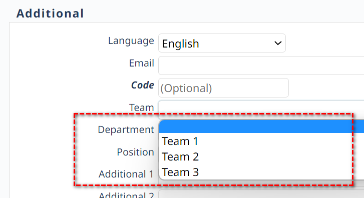

## Edit Screen: Customise Objects of the User Form.

### Question:

Within the user form, there are text input fields such as "Team" and "Organization" that accept any user input. 
However, I would like to substitute these text fields with select fields, enabling the selection of only predefined values. 
Based on my understanding, modifications to the core forms are overwritten during updates.
Is there any way to achieve this regardless? I'm aiming to avoid the inclusion of invalid entries in certain fields.

### Answer:

Changes to nuBuilder's core forms are reset to their initial state whenever you run an update.
To prevent this from happening, you can place JavaScript code in the (Setup->) Header.

This example shows how to turn the Team and Department Text objects into Select object.

<p align="left">
  
</p>

☛  Add this code in the **Header** (❓ [Home ► Setup](/codelib/common/setup_header.gif)). Click Save and log in again.


```javascript
// This function will be run after each Edit Form loads.
function nuLoadEditGlobal(formId, formCode) {

     if (formCode == 'nuuser') {
        nuReplaceWithSelectObject('sus_team', ["","Team 1", "Team 2", "Team 3"]);
        nuReplaceWithSelectObject('sus_department', ["","Department 1", "Department 2"]);
     }
	 
}

function nuReplaceWithSelectObject(i, options) {
  const el = $('#' + i);

  const pos = el.position();
  const height = el.height();
  const width = el.width() + 2;
  const id = el.data('nu-object-id');
  const field = el.data('nu-field');
  const tab = el.data('nu-tab');
  const placeholder = el.attr('placeholder');
  const title = el.attr('title');
  const value = el.val();

  const select = $('<select></select>', {
    id: i,
    onchange: 'nuChange(event)'
  });

  options.forEach(option => {
    const isSelected = option === value;
    const optionElement = new Option(option, option, false, isSelected);
    select.append(optionElement);
  });

  const elNew = select;
  el.replaceWith(elNew);

  elNew.css({
    top: pos.top,
    left: pos.left,
    height: height,
    width: width,
    position: 'absolute'
  }).attr({
    'data-nu-object-id': id,
    'data-nu-field': field,
    'data-nu-form': '',
    'data-nu-tab': tab,
    'data-nu-format': '',
    'data-nu-prefix': '',
    'data-nu-type': 'input',
    'data-nu-data': '',
    'data-nu-access': '0',
    placeholder: placeholder,
    title: title
  });
}

```

