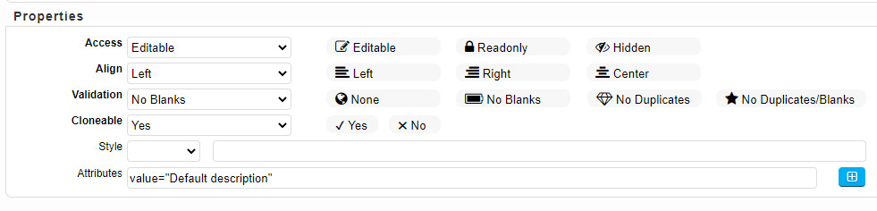
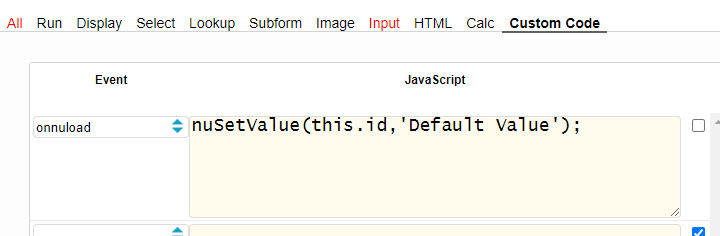
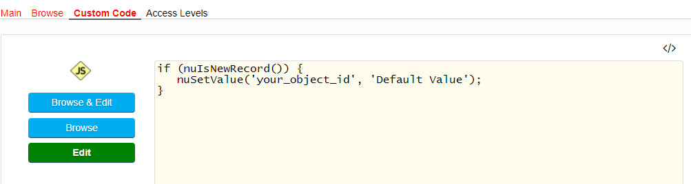
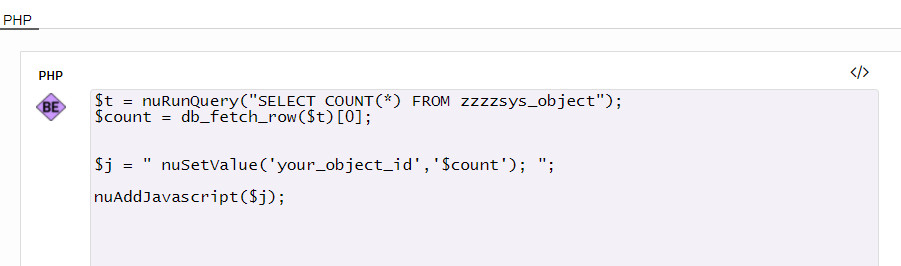

### Object: Set an initial (default) value

This article explains four different ways to set an initial (default) value for an object when a form is loaded.

#### 1) Attributes field (for Input Objects)

To set a static default value for *Input* Objects, use an object's Attributes field.

The value attribute is used differently for different input types:

- Button Object: It defines the text on the button
- Input Type Text: - It defines the initial (default) value of the input field
- Input Type Checkbox: It defines the value associated with the input (this is also the value that is sent on submit)

<p align="left">
  
</p>


#### 2) Object's Custom Code: onnuload event

To set a default value for (almost) any object, you can use an object's onnuload event. This event is triggered when the form is loaded.
Using JavaScript allows you to set both a static or dynamic value (e.g. the current date). Use nuIsNewRecord() to determine if it is a new record.

✪ Example 1: Set a static value:

<p align="left">
  
</p>


✪ Example 2: Set a dynamic value (current date):

```javascript
if (nuIsNewRecord()) {
   nuSetDateValue(this.id);
}   
```

#### 3) Form's Custom Code

To set a default value for (almost) any object, you can also use a form's Custom Code.

<p align="left">
  
</p>


#### 4) Form's PHP BE (Before Edit) event

This is the most powerful way to set an object's initial value. Using PHP, the value can be retrieved from with a database query.

<p align="left">
  
</p>


