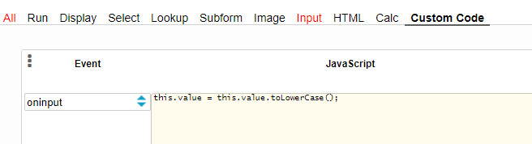

### Object: Transform text as you type

To transform text as you type, add an oninput event to an object.

#### ✪ Example:

Convert all of the characters to lowercase.

```javascript
this.value = this.value.toLowerCase();
```

<p align="left">
  
</p>
