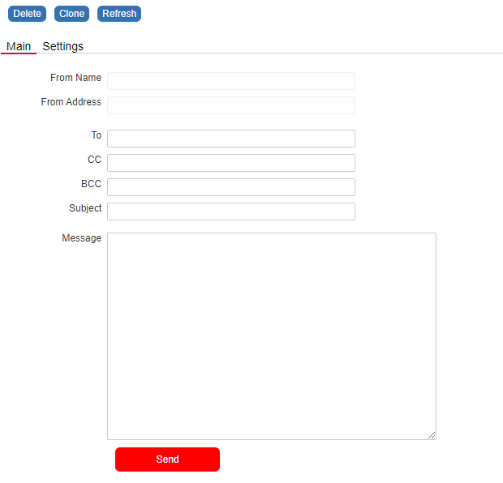

## UX: Position the Save Button within the Form

The `nuAttachSaveButtonTo()` function attaches the save button to a specified object within a form.  
It allows for precise positioning and styling by specifying optional offsets, dimensions, and font size.  
If no width or height is specified, the function defaults to the save button's existing dimensions.


<p align="left">
  
</p>


☛ Add this JavaScript to your form's Custom Code field:
 ❓ [How to add Custom Code](/codelib/common/form_add_custom_code_javascript.gif)

```javascript

if (nuFormType() == 'edit') {
         // Attach the Save button to another object. E.g. to ema_message in this example.
        nuAttachSaveButtonTo('ema_message', 0, 0, 30, 120, '12');
}

```
